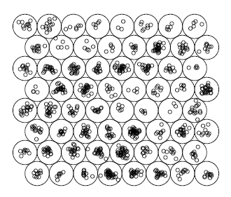
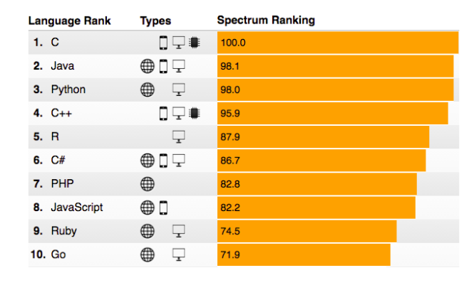
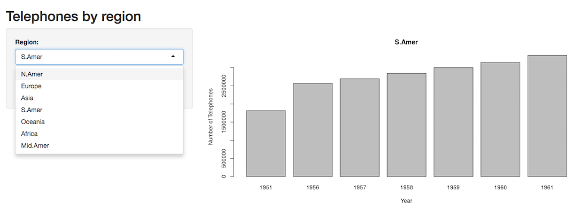
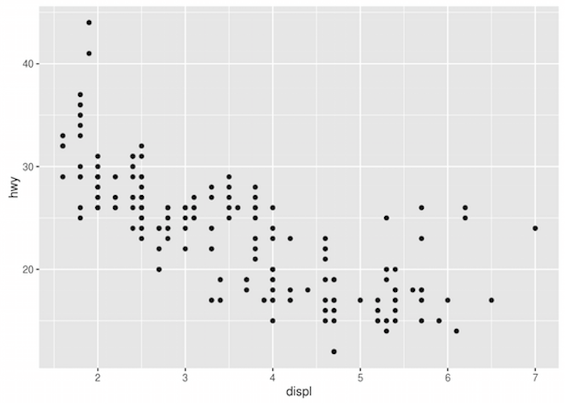
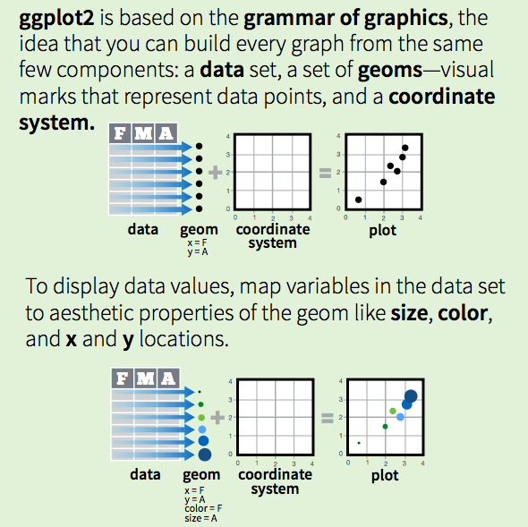
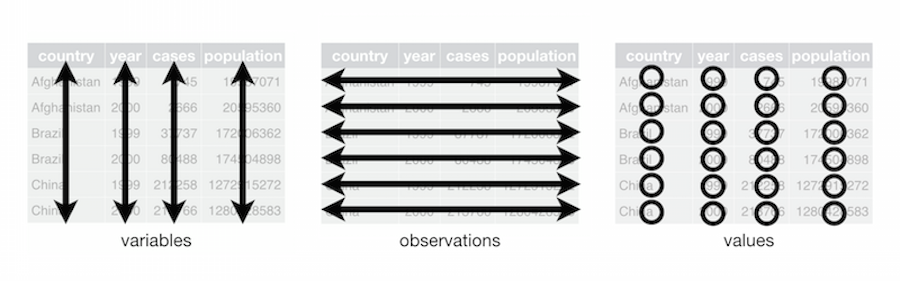
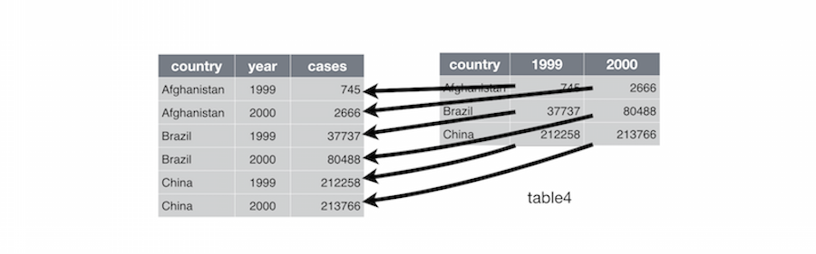
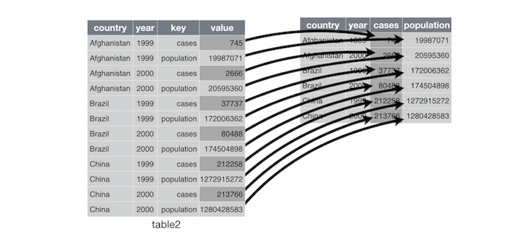
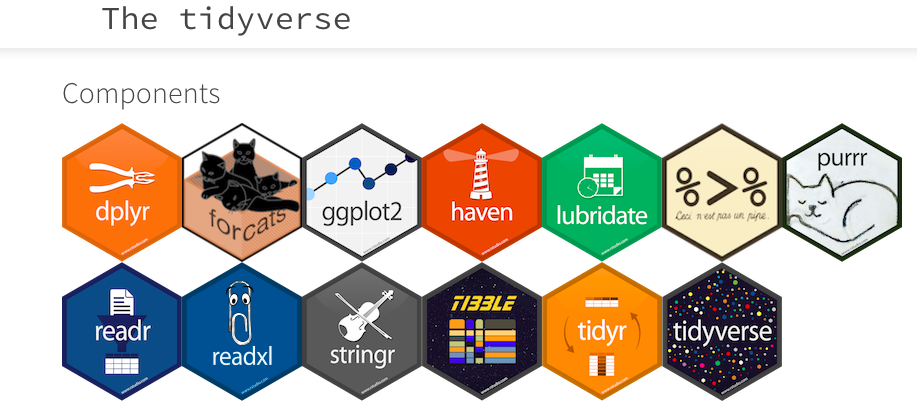

  
```{r setup, include=FALSE}
knitr::opts_chunk$set(echo = TRUE, fig.width=5, fig.height=5, error=FALSE, message=FALSE)
```

```{r echo=FALSE}

library("tidyverse")
library("highcharter")
library("leaflet")
library("plotly")
library("rbokeh")

```

## Workshop materials

* **Guide**: [go.ncsu.edu/dvr](https://go.ncsu.edu/dvr)
* **Script**: [go.ncsu.edu/dvrs](https://go.ncsu.edu/dvrs)

## Workshop goals 

* learn about various packages for making data visualizations in R 
* be able to determine which package to use 
* understand basic syntax for the most popular package: ggplot2
* gain hands-on practice making visualizations in ggplot2


By Censusdata at en.wikipedia, CC BY 3.0, [source](https://commons.wikimedia.org/w/index.php?curid=18210853)

## What you will need

* [installation of R (version 3.3.2 or newer)](http://archive.linux.duke.edu/cran/)
* [RStudio](https://www.rstudio.com/products/rstudio/download/) - select the free version
* [this script](https://drive.google.com/open?id=0Bz7G_jKybSBsVE1TbnNWLUpXejg) -download it and open in RStudio


## What is R?

R is a software environment for statistical computing and graphics. Using R you can do rigorous statistical analysis, clean and manipulate data, and create publication-quality graphics.



*clustering map*
  
## Popularity of R 
  


Source: Stephen Cass, ["The 2016 Top Programming Languages"](http://spectrum.ieee.org/computing/software/the-2016-top-programming-languages), IEEE Spectrum

## R packages 

Packages are programs that you import into R to help make tasks easier. The most popular R packages for working with data include *dplyr, stringr, tidyr, and ggplot2*. 

**How to find a package**
  
There's no easy way (yet) for new R users to find R packages that they might need. People are working on this problem. In the meantime, consult the following list or ask a Librarian!

Resources include: 

* Google ("Top R packages for ....")
* Looking at trending R packages on [rdocumentation.org](https://www.rdocumentation.org/trends)

## Popular R packages for data viz 

* ggplot2
* ggvis

htmlwidgets:

* highcharter
* leaflet
* plotly
* rbokeh 
* shiny

## Base R functions for plotting

You can create graphs in R without installing a package, but packages will allow you to create better visualizations that are any of the following:

* attractive
* publication-quality
* interactive

This is an example of a plot created with the base R histogram function. The data is a histogram of the miles-per-gallon (mpg) measurements of cars in a dataset called mtcars.
```{r}
hist(mtcars$mpg)

```

## Example with R package ggplot2

```{r}

ggplot(mtcars, aes(x=mpg)) + geom_histogram(binwidth=1, color="black", fill="white")

```

## ggplot2

ggplot2 is the most popular visualization package for R. It's the best all-purpose package for creating many types of 2-dimensional visualizations. 


[Source: r-statistics.co](http://r-statistics.co/Top50-Ggplot2-Visualizations-MasterList-R-Code.html)

## highcharter
Highcharter is an R package known as an htmlwidget, which allows you to use popular javascript packages for visualization and create interactive web charts. Highcharter is the R interface to the popular highchartsJS, a charting library in javascript. It's free to use highcharter unless you are using it for a commercial or government purpose.

```{r fig.width=6, fig.height=4}
data(citytemp)

hc <- highchart() %>% 
hc_xAxis(categories = citytemp$month) %>% 
hc_add_series(name = "Tokyo", data = citytemp$tokyo) %>% 
hc_add_series(name = "London", data = citytemp$london) %>% 
hc_add_series(name = "Other city",
data = (citytemp$tokyo + citytemp$london)/2)

hc
```


## leaflet

Leaflet is popular among web developers for creating interactive web maps. It's an htmlwidget for R based on LeafletJS.

```{r fig.width=6, fig.height=4}

m <- leaflet(options = leafletOptions(zoomControl = FALSE, dragging=FALSE, minZoom = 15, maxZoom = 15)) %>%
  addTiles() %>%  # Add default OpenStreetMap map tiles
  addMarkers(lng=-78.6697, lat=35.7876,
             popup="Hello World!")
m  # Print the map

```


## plotly

Plotly is somewhat new and is making inroads among data scientists for making interactive visualizations. 

```{r fig.width=6, fig.height=4}

p <- plot_ly(economics, x = ~date, y = ~unemploy / pop)
p

```


## rbokeh

rbokeh allows you to create elegant-looking interactive graphs

```{r fig.width=6, fig.height=4}

h <- figure(width = 600, height = 400) %>%
  ly_hist(eruptions, data = faithful, breaks = 40, freq = FALSE) %>%
  ly_density(eruptions, data = faithful)
h

```


## shiny

shiny is a popular R package for creating web applications. 



## Deciding on the right package

* static or interactive
* single viz or dashboard
* the nature of the data: geospatial? quantitative? qualitative? 
* purpose and licensing

## Recommended packages

* 2D vizzes: **ggplot2** 
* 3D vizzes: **rgl** 
* maps: **leaflet**
* interactive: **ggvis, rbokeh, plotly, or highcharter**
* network graphs: **ggnet, diagrammeR, visNetwork**
* web applications: **shiny**
  
## ggplot2: the most important package to learn first
**ggplot2** was created on the principles of the **Layered Grammar of Graphics** (2010), by Hadley Wickham and based of off work from Wilkinson, Anand, & Grossman (2005) and Jaques Bertin (1983). 

Essentially: graphs are like sentences you can construct, and they have a grammar. The grammar of graphics consists of the following: 
  
At least one layer:  
**data** & **aesthetic mapping** of the data to variables  
**stat** - a statistical transformation of the data -- sum, mean, etc.  
**geom** - geometric object (geom) -- point, line, bar, etc  
**position adjustment** - stacking, jitter, etc.  

plus the following:  
**scale**     
**coordinate system**   
**facet** (optional)  

**These components make up a graph.**

  


## Grammar of Graphics



Credit: RStudio, Inc. • CC BY RStudio • info@rstudio.com • 844-448-1212 • rstudio.com

## Tidy Data

**Tidy data** is a way of structuring a data set to make it easier to work, proposed by Hadley Wickham (2014). 

Tidy data has the following characteristics: "each variable is a column, each observation is a row, and each type of observational unit is a table."



credit: Hadley Wickham

## Tidy data cont'd

Collapse columns of multiple years into one variable: year

  

credit: Hadley Wickham

## Tidy data cont'd

Unpack columns of more than one variable into distinct columns. Remember: only one column per variable!



credit: Hadley Wickham

## The Tidyverse

The tidyverse is a set of packages for working with data that include packages for cleaning, manipulating, and visualizing data in R. We will be using the tidyverse package in our workshop activity. See the [tidyverse website](http://tidyverse.org/) For more information about tidyverse package.



## ggsave()

**ggsave()** is a function within ggplot2 to save your graphs as files to your computer.  

Using ggsave, you can save charts to the following file formats:   
  eps, ps, tex (pictex), pdf, jpeg, tiff, png, bmp, svg or wmf (windows only)

## Open script.R file

Download the following file: **[script.R](https://drive.google.com/open?id=0Bz7G_jKybSBsUXlzTGZoVlpYQlU)**
  Click the blue download button  
Open RStudio. 
File > Open File...   
Select the **script.R** file that you just downloaded  (probably in your Downloads folder)
Click Open  

## Get to know the data
Let's see an example of a simple graph created with ggplot. We are going to use the `mpg` data set about different cars and their properties. 

#### Exercise #1: 
In your script file, run `?mpg` to learn more about this dataset. To run the code, highlight it and then click Run. (shortcut keys: Mac: command + Enter, Windows: CTRL + Enter)

```{r}

?mpg 

```

## Exercise #2: Look at the data

Run `head(mpg)` to see the first few rows of the data.

```{r}

head(mpg)

```

## Exercise #3: ggplot syntax

The graph below uses ggplot2 to look for correlation between a car's engine displacement and highway mileage.

* `library(ggplot2)`: loads the ggplot2 library
* `ggplot()` : function that tells R that you want to make a graph with ggplot
* `data = mpg` : says that you want to use the mpg dataset (sample data that comes with R)
* `geom_point()`: function that says you want to make a scatterplot
* `mapping = aes()`: function that allows you to map data variables to X and Y axes

**Run the following code in your script file**
  
```{r mpg}

ggplot(data = mpg) + geom_point(mapping = aes(x = displ, y = hwy))

```


## Exercise #4: Practice

Make a scatterplot with `cyl` mapped to the x-axis and `hwy` mapped to the y-axis.

```{r echo=FALSE}

ggplot(data= mpg) + geom_point(mapping = aes(x=cyl, y=hwy))

```

## Solution to #4

```{r eval=FALSE}

ggplot(data= mpg) + geom_point(mapping = aes(x=cyl, y=hwy))

```

## Exercise #5: Mapping a variable to color

Make a scatterplot of `disp`=x and `hwy`=y with class mapped to the `color` aesthetic. Run:

```{r}

ggplot(data = mpg) + 
  geom_point(mapping = aes(x = displ, y = hwy, color = class))

```

## Exercise #6: Make the same scatterplot as the previous example, but map drv to color.

```{r echo=FALSE}
ggplot(data = mpg) + 
  geom_point(mapping = aes(x = displ, y = hwy, color = drv))
```

## Solution to #6

The type of drive system the car has (4-wheel, rear-wheel, and front-wheel) is mapped to color.

```{r eval=FALSE}
ggplot(data = mpg) + 
  geom_point(mapping = aes(x = displ, y = hwy, color = drv))
```

## Exercise #7: Aesthetic parameters

Variables can be mapped to the following aesthetic parameters. If you are publishing in b/w, and can't use color, you might want to use size or shape:

* `color`
* `size`
* `shape`
* `alpha` - transparency

**Substitute another aesthetic in place of `color`. Run the code:**

```{r eval=FALSE}

ggplot(data = mpg) + 
geom_point(mapping = aes(x = displ, y = hwy, shape = drv))

```

## Exercise #8: Faceting

Facets are a way to create multiple smaller charts, or subplots, based on a variable. Run this code to see what faceting does:

```{r}

ggplot(data = mpg) + 
geom_point(mapping = aes(x = displ, y = hwy)) + 
facet_wrap(~ class, nrow = 2)

```

## Exercise #9: Practice Faceting 

**Substitute `class` for another variable in the dataset. Ex: `trans`, `drive`, or `cyl`**

```{r eval=FALSE}

ggplot(data = mpg) + 
geom_point(mapping = aes(x = displ, y = hwy)) + 
facet_wrap(~ class, nrow = 2)

```

## Exercise 10: facet_grid

Facet grids allow for an extra dimension of faceting. Run this code in your script to see what facet_grid() does:

```{r}
ggplot(data = mpg) + geom_point(mapping = aes(x = displ, y = hwy)) + 
facet_grid(class ~ cyl)
```

Compare above result with the code below. What do the empty cells in the above graph mean?

```{r}
ggplot(data = mpg) +
geom_point(mapping = aes(x = class, y = cyl))
```

## Exercise 11: Apply what you've learned!
  
Now create a new scatter plot with the dataset `diamonds` using ggplot2. Refer to previous code examples for assistance.

```{r}
head(diamonds)
```


## Example: 

```{r}
ggplot(data = diamonds) + 
  geom_point(mapping = aes(x = carat, y = price, color=cut)) + facet_wrap(~cut, nrow=2)
```

## Exercise 12: Adding multiple layers to a graph

So far we have just worked with one chart layer. But it's possible to add more layers to charts in ggplot2, and style those layers individually if you want to. Here's an example using `geom_smooth()`, which fits a model to the data. Notice that the `color` variable is only applied to the scatter points, and not the line. 

```{r}

ggplot(data = diamonds) + 
  geom_point(mapping = aes(x = carat, y = price, color=cut)) +
  geom_smooth(mapping = aes(x = carat, y = price))

```


## Exercise 13: Coding for efficiency 

To reduce typing, put the aesthetics that are shared by all layers (global) in the ggplot() function. Put unique aesthetics in the geom() functions that are specific to that (local) layer only. Run this code to see what happens:
  
```{r}
ggplot(data = diamonds, mapping = aes(x = carat, y = price)) + 
  geom_point(aes(color=cut)) +
  geom_smooth()

```

## Exercise 14: Practice putting aesthetics in ggplot() function
Now use the short hand method to make the following code more efficient. Type your answer in the script:
  
```{r}
ggplot(data = diamonds) + 
  geom_point(mapping = aes(x = carat, y = price, color=clarity)) +
  geom_smooth(mapping = aes(x = carat, y = price))
```

## Solution to #14

```{r eval=FALSE}
ggplot(data = diamonds, mapping = aes(x=carat, y=price)) + 
  geom_point(aes(color=clarity)) +
  geom_smooth()
```

It's also possible to write it even more efficiently:

```{r eval=FALSE}
ggplot(diamonds, aes(carat, price)) + geom_point(aes(color=clarity)) + geom_smooth()

```

## Exercise 15: Position adjustments

The previous chart has some issues with data points overlapping, and also too many spaghetti lines. We can use `alpha`, which is an aesthetic, and `position` to help reduce some of that overlap. Remember that `position` is one of the elements in the layered grammar of graphics. 

`alpha` - use to make points more transparent so you can see points underneath
`position`: takes values `identity`, `dodge`, `fill`, or `jitter`

```{r}
ggplot(data =diamonds, mapping = aes(carat, price)) + geom_point(mapping = aes(color=clarity, alpha=1/5), position="jitter") + geom_smooth()

```

## Other chart types in ggplot2

To make a scatter plot, we used the `geom_point()` function. You can use different `geom` functions to make other chart types. Here are just a few examples of the many `geom` functions:

* `geom_abline()`
* `geom_bar()`
* `geom_boxplot()`
* `geom_density()`

Each function can take certain parameters. To learn more about a function, you can type `?+name of function`, for example, `?geom_bar`

## Bar Chart Example

Use geom_bar() function to create a bar chart. Without a specified y variable, bar charts in ggplot calculate `count`, a new value.
`count` is a statistical tranformation of your data that ggplot2 automatically does. 

#### Exercise 16. Run this example of a bar chart: 

```{r}
ggplot(data = diamonds) + 
geom_bar(mapping = aes(x = cut))

```

## Exercise 17: Bar Chart Practice

Create a bar chart where **x = clarity**.

Modify this code from the previous example: 

```{r eval=FALSE}
ggplot(data = diamonds) + 
geom_bar(mapping = aes(x = cut))

```

## Solution to #17

```{r}
ggplot(data = diamonds) + 
geom_bar(mapping = aes(x = clarity))

```

## Statistical transformations

`stat` is another part of the grammar of graphics: essentially, a statistical tranformation of the data. Each layer has one.   

`geom` functions each have their own default `stat`, or statistical transformation, measures, that transform the data. 
* `geom_bar` has a default `stat` called `count`
* `geom_histogram` has `bin`
...and so on

It's possible to change these default settings, but normally, you don't need to. Notice that we didn't have to set `stat` to a value in order to create a bar chart.  

To find out how to do this, type ?+package name in the console. Example `?geom_bar()`


## Creating charts for communication

Once you're ready to publish your graph, you should add information that helps communicate the content with your audience.`labs()` function allows you to add labels so that you can turn it into expository graphic.

## Exercise 18: Adding labels: title, subtitle, caption

```{r}
ggplot(mpg, aes(displ, hwy)) +
geom_point(aes(color = class)) +
geom_smooth(se = FALSE) +
labs(
title = "Fuel efficiency generally decreases with engine size",
subtitle = "Two seaters (sports cars) are an exception because of their light weight",
caption = "Data from fueleconomy.gov"
)
```

**You can also use labs() to replace the axis and legend titles.**

## Exercise 19: Add x and y axis labels

In the previous example, add x = "Engine displacement (L)", y = "Highway fuel economy (mpg)", and color = "Car type" in the lab

Use this to help you: 

ggplot(mpg, aes(displ, hwy)) +  
geom_point(aes(color = class)) +  
geom_smooth(se = FALSE) +  
labs(  
title = "Fuel efficiency generally decreases with engine size",  
subtitle = "Two seaters (sports cars) are an exception because of their light weight",  
caption = "Data from fueleconomy.gov",  
x = "_______________",  
y = "_______________",  
color = "__________"  
)


```{r echo=FALSE}
ggplot(mpg, aes(displ, hwy)) +
geom_point(aes(color = class)) +
geom_smooth(se = FALSE) +
labs(
title = "Fuel efficiency generally decreases with engine size",
subtitle = "Two seaters (sports cars) are an exception because of their light weight",
caption = "Data from fueleconomy.gov",
x = "Engine displacement (L)",
y = "Highway fuel economy (mpg)",
color = "Car type"
)
```

## Solution to 19

```{r eval=FALSE}
ggplot(mpg, aes(displ, hwy)) +
geom_point(aes(color = class)) +
geom_smooth(se = FALSE) +
labs(
title = "Fuel efficiency generally decreases with engine size",
subtitle = "Two seaters (sports cars) are an exception because of their light weight",
caption = "Data from fueleconomy.gov",
x = "Engine displacement (L)",
y = "Highway fuel economy (mpg)",
colour = "Car type"
)
```

## Saving your graph with ggsave()

This is the syntax for the ggsave() function. The default dpi (dots per inch) value is 300. 

```{r eval=FALSE}

ggsave(filename, plot = last_plot(), device = NULL, path = NULL,
scale = 1, width = NA, height = NA, units = c("in", "cm", "mm"),
dpi = 300, limitsize = TRUE, ...)

```

## Exercise 20
Assign your graph to a variable name

```{r}

my_graph <-ggplot(mpg, aes(displ, hwy)) +
geom_point(aes(color = class)) +
geom_smooth(se = FALSE) +
labs(
title = "Fuel efficiency generally decreases with engine size",
subtitle = "Two seaters (sports cars) are an exception because of their light weight",
caption = "Data from fueleconomy.gov",
x = "Engine displacement (L)",
y = "Highway fuel economy (mpg)",
colour = "Car type"
)  

``` 

## Exercise 21 
Use a basic ggsave() function to save graph as a .PNG file

```{r eval=FALSE}

ggsave("graph.png", my_graph)

```

## Exercise 22: Re-save graph as a different size

```{r eval=FALSE}

ggsave("graph_resized.png", my_graph, width = 5, height = 4, units="in")

```

## Exercise 23: Save to publication-quality .tiff file

```{r eval=FALSE}

ggsave("graph.tiff", my_graph, width = 5, height = 4, units="in")

```

## Advanced chart labeling
Labelling major components of a plot is often useful to communicate with audience. There are multiple ways of creating annotations but the first helpful tool is geom_text(). The "label" aesthetic of geom_text() makes it possible to add textual labels.

## Example

In this advanced example, we will label the total number of cars from each manufacturer in the mpg dataset and place labels above the bars. Each label is the n value (n= total number of observations) per car manufacturer. This will produce a colorful stacked bar chart.

```{r fig.width=13, eval=FALSE}

manufacturer <- mpg$manufacturer
total_cars = as_data_frame(count(mpg, manufacturer, y=1))
ggplot(mpg, aes(x=manufacturer)) + 
geom_bar(aes(fill=class), position="fill") +
scale_y_continuous(name="proportion") + 
geom_text(data=total_cars, aes(x=manufacturer, y=y, label=n), size=4, vjust = -0.2)

```

## Advanced labeling exercise

Now create a similar bar plot using the diamonds dataset labeling the total number of diamonds for each type of clarity and showing the proportion of their cut types. Here is the code - try filling in the blanks!

clarity <- diamonds$clarity 

totals = as_data_frame(count(diamonds, ______ , y=1))

ggplot(diamonds, aes(x=clarity)) + 
geom_bar(aes( fill=cut), position="fill") +
scale_y_continuous(name="proportion") + 
geom_text(data=totals, aes(x= ______ , y=y, label=n), size=4, vjust = -0.2)


```{r echo=FALSE, eval=FALSE, fig.width=8}

clarity <- diamonds$clarity

totals = as_data_frame(count(diamonds, clarity, y=1))

ggplot(diamonds, aes(x=clarity)) + 
geom_bar(aes( fill=cut), position="fill") +
scale_y_continuous(name="proportion") + 
geom_text(data=totals, aes(x=clarity, y=y, label=n), size=4, vjust = -0.2)

```

## Solution

```{r eval=FALSE}

clarity <- diamonds$clarity  
totals = as_data_frame(count(diamonds, clarity, y=1))

ggplot(diamonds, aes(x=clarity)) + 
geom_bar(aes( fill=cut), position="fill") +
scale_y_continuous(name="proportion") + 
geom_text(data=totals, aes(x=clarity, y=y, label=n), size=4, vjust = -0.2)
```
