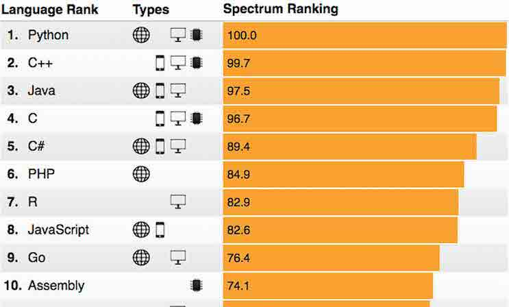
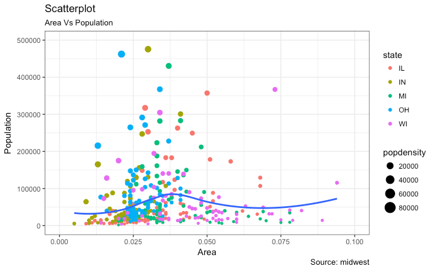
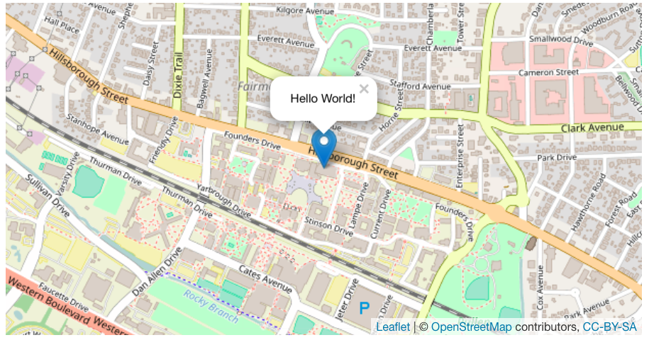
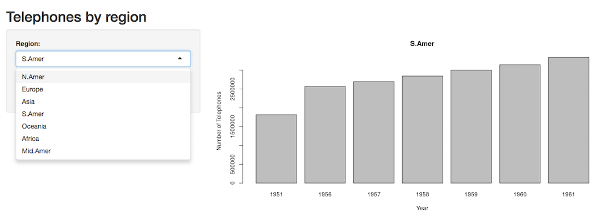
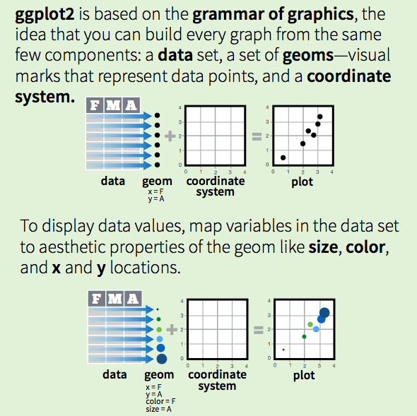
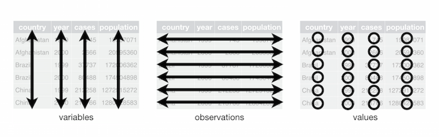
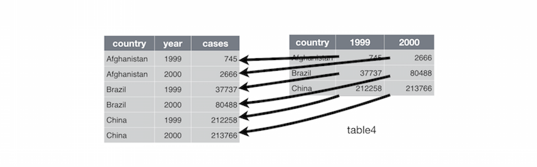
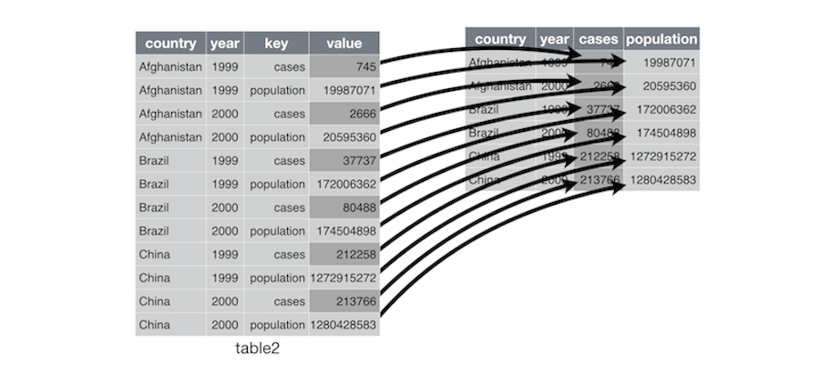
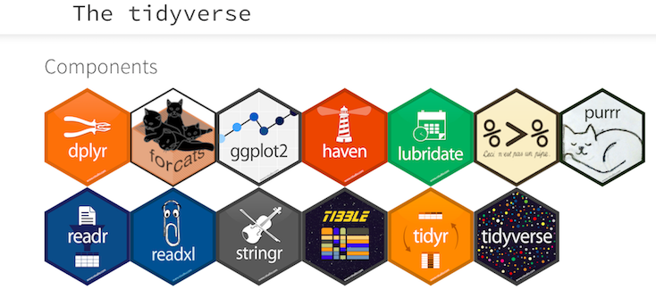

  
```{r setup, include=FALSE}
knitr::opts_chunk$set(echo = TRUE, fig.width=4, fig.height=4, error=FALSE, message=FALSE)
```

```{r echo=FALSE}
## Need to install the following packages: 
#install.packages("revealjs")
#install.packages("tidyverse")
#install.packages("highcharter")
#install.packages("leaflet")
#install.packages("plotly")
library("revealjs")
library("tidyverse")
library("highcharter")
library("leaflet")
library("plotly")
```

## RStudio.Cloud Workspace
This is an online version of RStudio where we will be working today. We will use this for the hands-on activity portion. Visit this site and create an account, or log in with a gmail account:

**[go.ncsu.edu/dvr](https://go.ncsu.edu/dvr)**

## Workshop goals 

* learn about various packages for making data visualizations in R 
* be able to determine which package to use 
* understand basic syntax for the most popular package: ggplot2
* gain hands-on practice making visualizations in ggplot2
* learn ways to save visualizations

## What is R?

R is a software environment for statistical computing and graphics. Using R you can do rigorous statistical analysis, clean and manipulate data, and create publication-quality graphics.


*clustering map*
  
## Popularity of R 
  


Stephen Cass, ["The 2018 Top Programming Languages"](https://spectrum.ieee.org/at-work/innovation/the-2018-top-programming-languages), IEEE Spectrum

## R packages 

Packages are programs that you import into R to help make tasks easier. The most popular R packages for working with data include *dplyr, stringr, tidyr, and ggplot2*. 

Find a package: 

* Google ("Top R packages for ....")
* Looking at trending R packages on [rdocumentation.org](https://www.rdocumentation.org/trends)

## Popular R packages for data viz 

* base R
* ggplot2
* highcharter
* leaflet
* plotly
* shiny

## Base R Plot 
This is an example of a plot created with the base R histogram function. 
```{r}
hist(mtcars$mpg)
```

## Example with R package ggplot2

```{r}
ggplot(mtcars, aes(x=mpg)) + geom_histogram(binwidth=1, col="white") + theme_classic()
```

## ggplot2

ggplot2 is the most popular visualization package for R. It's the best all-purpose package for creating many types of 2-dimensional visualizations. 



[Source: r-statistics.co](http://r-statistics.co/Top50-Ggplot2-Visualizations-MasterList-R-Code.html)

## highcharter
Highcharter is an R package known as an htmlwidget, which allows you to use popular javascript packages for visualization and create interactive web charts. It's free to use highcharter unless you are using it for a commercial or government purpose.

```{r fig.width=6, fig.height=4, eval=FALSE}
data(citytemp)

hc <- highchart() %>% 
hc_xAxis(categories = citytemp$month) %>% 
hc_add_series(name = "Tokyo", data = citytemp$tokyo) %>% 
hc_add_series(name = "London", data = citytemp$london) %>% 
hc_add_series(name = "Other city",
data = (citytemp$tokyo + citytemp$london)/2)

hc
```

## highcharter example

```{r fig.width=6, fig.height=4, echo=FALSE}
data(citytemp)

hc <- highchart() %>% 
hc_xAxis(categories = citytemp$month) %>% 
hc_add_series(name = "Tokyo", data = citytemp$tokyo) %>% 
hc_add_series(name = "London", data = citytemp$london) %>% 
hc_add_series(name = "Other city",
data = (citytemp$tokyo + citytemp$london)/2)

hc
```


## leaflet

Leaflet is popular among web developers for creating interactive web maps. It's an htmlwidget for R based on LeafletJS.

```{r fig.width=6, fig.height=4, eval=FALSE}

m <- leaflet(options = leafletOptions(zoomControl = FALSE, dragging=FALSE, minZoom = 15, maxZoom = 15)) %>%
  addTiles() %>%  # Add default OpenStreetMap map tiles
  addMarkers(lng=-78.6697, lat=35.7876,
             popup="Hello World!")
m  # Print the map

```

## leaflet example



## plotly

```{r, fig.width = 8, fig.height=5}

plot_ly(economics, x = ~date, y = ~unemploy / pop)


```


## shiny

shiny is a popular R package for creating web applications. 



## Deciding on the right package

* static or interactive
* single viz or dashboard
* the nature of the data: geospatial? quantitative? qualitative? 
* purpose and licensing

## Recommended packages

* 2D vizzes: **ggplot2**, **ggpubr** 
* 3D vizzes: **rgl** 
* maps: **leaflet**
* interactive: **shiny, plotly, or highcharter**
* network graphs: **igraph, ggnet, diagrammeR, visNetwork**
* web applications: **shiny**
  
## ggplot2: one of the most popular

**ggplot2** was created on the principles of the **Layered Grammar of Graphics** (2010), by Hadley Wickham and based of off work from Wilkinson, Anand, & Grossman (2005) and Jaques Bertin (1983). 

## Grammar of Graphics



Credit: RStudio, Inc. • CC BY RStudio • info@rstudio.com • 844-448-1212 • rstudio.com

## Tidy Data
Proposed by Hadley Wickham (2014). 

Tidy data has the following characteristics: "each variable is a column, each observation is a row, and each type of observational unit is a table."



credit: Hadley Wickham

## Tidy data cont'd

Collapse columns of multiple years into one variable: year

  

credit: Hadley Wickham

## Tidy data cont'd

Unpack columns of more than one variable into distinct columns. Remember: only one column per variable!


credit: Hadley Wickham

## The Tidyverse

The tidyverse is a set of packages for working with data that include packages for cleaning, manipulating, and visualizing data in R. We will be using the tidyverse package in our workshop activity. See the [tidyverse website](http://tidyverse.org/) For more information about tidyverse package.



## Hands-On Activity: Open RStudio.Cloud Workspace

[https://go.ncsu.edu/dvr](https://go.ncsu.edu/dvr)

* Log in with Google, Github, or create an account  
* We will step through the code together and you will have a chance to practice!

