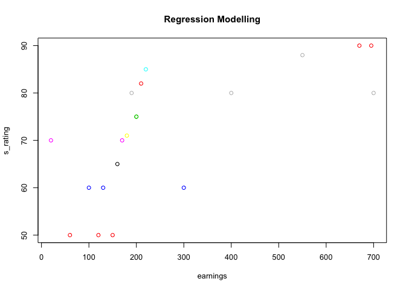
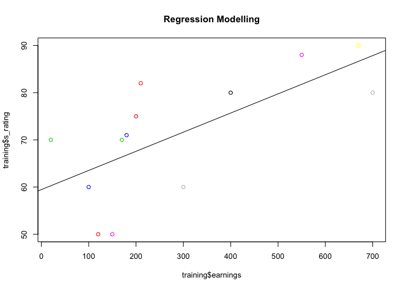
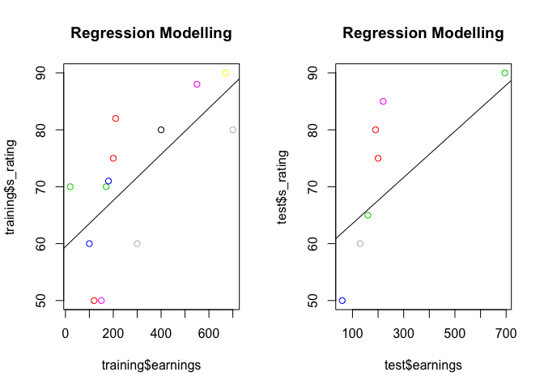
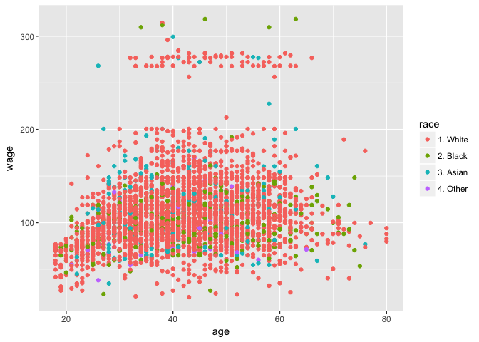
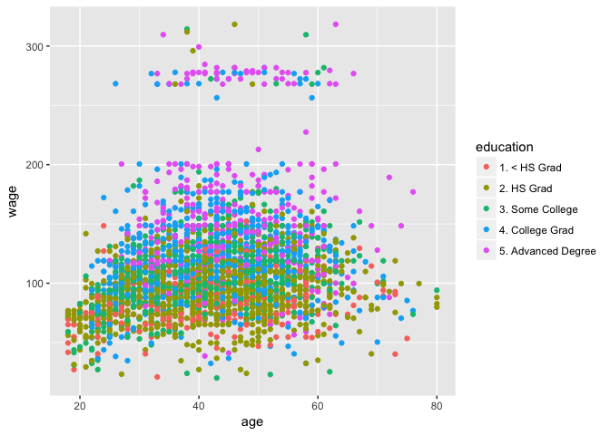
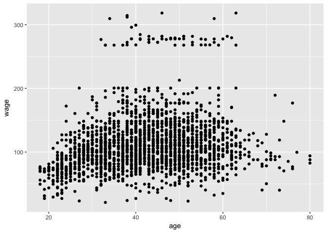
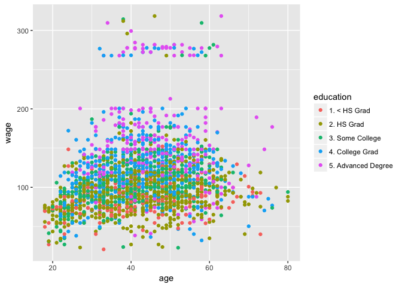
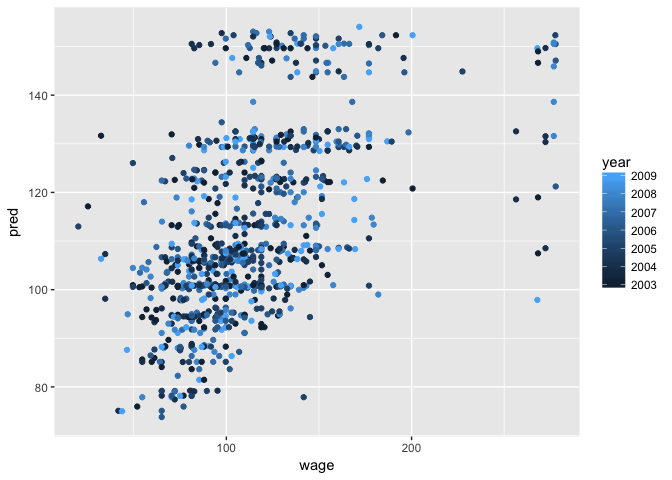
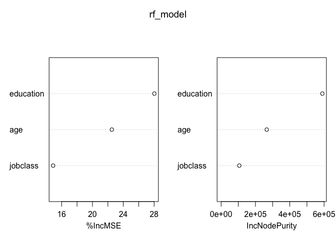

Hands-on coding instruction
================
Ruth Okoilu
July 28, 2017

This instruction set features two (2) Machine Learning applications.
--------------------------------------------------------------------

### The first example uses Regression analysis while the other uses Random Forest algorithm.

This is an example of how to perform Linear regression modelling.

We intend to fit a simple regression model. This model is a line. Regression modelling is used to find equations that fit data

The equation is of the form:

y = a + bx + ei

y is what we want to predict and x includes all the predictors required to form the model above. a and b are coefficients determined by the **"lm"** function we'll use shortly. Regression model is easy to implement but it often produces low performance models. This method is useful when the variable involved can be modelled in a linear way.

For example, increase in age leads to increase in weight, or increase in age leads to decrease in the number of hairs on head. This cannot be used in showing increase in library visitor per day of the week. This is usually Non linear.

Example \#1: Does Money Buy Happiness? Correlation Between Salary and Employee Satisfaction
-------------------------------------------------------------------------------------------

``` r
# Install package "caret" if you do not have it already
#install.packages("caret")
#Load caret package
library(caret)
```

    ## Loading required package: lattice

    ## Loading required package: ggplot2

``` r
#Create a tidy dataset:
#  What makes this dataset tidy?

# earnings  - Employee Earnings
# s_rating  - Employee Satisfaction rating
# emp_data  - data.frame(earning, s_rating)
earnings <- c(120, 100, 700, 200, 60, 20, 200, 130, 150, 160, 170, 180, 190, 210, 220, 400, 550, 670, 695, 300)

s_rating<- c(50, 60, 80, 75, 50, 70, 75, 60, 50, 65, 70, 71,80, 82, 85, 80, 88, 90, 90, 60)

emp_data  <- data.frame(earnings, s_rating)

emp_data 
```

    ##    earnings s_rating
    ## 1       120       50
    ## 2       100       60
    ## 3       700       80
    ## 4       200       75
    ## 5        60       50
    ## 6        20       70
    ## 7       200       75
    ## 8       130       60
    ## 9       150       50
    ## 10      160       65
    ## 11      170       70
    ## 12      180       71
    ## 13      190       80
    ## 14      210       82
    ## 15      220       85
    ## 16      400       80
    ## 17      550       88
    ## 18      670       90
    ## 19      695       90
    ## 20      300       60

``` r
set.seed(222)
inTrain <- createDataPartition(y= emp_data$s_rating, p=0.6, list=FALSE)

training <- emp_data[inTrain,]
test <- emp_data[-inTrain,]
head(training)
```

    ##   earnings s_rating
    ## 1      120       50
    ## 2      100       60
    ## 3      700       80
    ## 6       20       70
    ## 7      200       75
    ## 9      150       50

``` r
summary(training)
```

    ##     earnings      s_rating    
    ##  Min.   : 20   Min.   :50.00  
    ##  1st Qu.:150   1st Qu.:60.00  
    ##  Median :200   Median :71.00  
    ##  Mean   :290   Mean   :71.23  
    ##  3rd Qu.:400   3rd Qu.:80.00  
    ##  Max.   :700   Max.   :90.00

We execute the line set.seed(222) above so that when analysis is reproduced, a similar result is gotten.

### Exploratory Data Analysis

You can also embed plots, for example:

``` r
par(cex=.8)
plot(earnings, s_rating, col = s_rating, main="Regression Modelling")
```



### Creating Our Model

We create and fit the line (formula) created by our model using the abline() function in R

``` r
reg_model <- lm(s_rating ~ earnings, data=training)
summary(reg_model)
```

    ## 
    ## Call:
    ## lm(formula = s_rating ~ earnings, data = training)
    ## 
    ## Residuals:
    ##     Min      1Q  Median      3Q     Max 
    ## -15.553  -7.858   3.636   6.225  14.014 
    ## 
    ## Coefficients:
    ##             Estimate Std. Error t value Pr(>|t|)    
    ## (Intercept) 59.46977    4.68820  12.685 6.56e-08 ***
    ## earnings     0.04056    0.01303   3.114  0.00986 ** 
    ## ---
    ## Signif. codes:  0 '***' 0.001 '**' 0.01 '*' 0.05 '.' 0.1 ' ' 1
    ## 
    ## Residual standard error: 10.01 on 11 degrees of freedom
    ## Multiple R-squared:  0.4684, Adjusted R-squared:  0.4201 
    ## F-statistic: 9.694 on 1 and 11 DF,  p-value: 0.009863

``` r
par(cex=.8)
plot(training$earnings, training$s_rating, col = s_rating, main="Regression Modelling")

# function to draw a regression line based on the model the machine created called reg_model
abline(reg_model)
```



``` r
# What are the coefficients a and b? To print ot the coefficients

print(coef(reg_model)[1])
```

    ## (Intercept) 
    ##    59.46977

``` r
print(coef(reg_model)[2])
```

    ##   earnings 
    ## 0.04055518

From y = a + bx + ei (ei = error measures factors that we didn't take into consideration about the model)

Our model simply produced the formula: Satisfaction = 0.04056(Earning) + 59.46977

### Test Model

We could create a function to test our model

``` r
predict_happiness <- function(x){
  Coef_1 = 0.04056
  Coef_2 = 59.46977
  Result<- (Coef_1 * x) + Coef_2 
  percent<- "%"
  cat(sprintf("The employee should be %s%s satisfied", Result, percent))
}
predict_happiness(test$earnings)
```

    ## The employee should be 67.58177% satisfied The employee should be 61.90337% satisfied The employee should be 64.74257% satisfied The employee should be 65.95937% satisfied The employee should be 67.17617% satisfied The employee should be 68.39297% satisfied The employee should be 87.65897% satisfied

Another way to test is to use the predict function provided by the caret package

``` r
# pred_rating - Predicted satisfaction rating
pred_rating <- predict(reg_model, test)
print(data.frame(test$s_rating, pred_rating))
```

    ##    test.s_rating pred_rating
    ## 4             75    67.58080
    ## 5             50    61.90308
    ## 8             60    64.74194
    ## 10            65    65.95860
    ## 13            80    67.17525
    ## 15            85    68.39191
    ## 19            90    87.65562

Test data helps us to see how accurate our model is. We can see that our model (the regression line) is not too precise. It however, made an attempt to accurately predict the satisfaction rating of the empolyee in row 10 above.

### Check the accuracy of model visually

You can also embed plots, for example:

``` r
par(mfrow=c(1,2))

plot(training$earnings, training$s_rating, col = s_rating, main="Regression Modelling")

abline(reg_model)  

plot(test$earnings, test$s_rating, col = s_rating, main="Regression Modelling")

abline(reg_model)  
```



### Accuracy of Our Model using RMSE

RMSE (root-mean-square deviation) - calculate mean squared errors on test sets RMSE measures deviation of predicted points to original value

You can also embed plots, for example:

``` r
# Realistic check because test dataset is new dataset
sqrt(sum((predict(reg_model, test) - test$s_rating)^2))
```

    ## [1] 25.80565

The above shows that our model's RMSE is 25.80565. A smaller value means more accurate model.

Example \#2: Predicting a person's wage based on age, profession and level of education
---------------------------------------------------------------------------------------

``` r
# Install the necessary packages
#install.packages("ISLR")
#install.packages(randomForest)
library(ISLR)
library(ggplot2)
library(caret)
library(randomForest)
```

    ## randomForest 4.6-12

    ## Type rfNews() to see new features/changes/bug fixes.

    ## 
    ## Attaching package: 'randomForest'

    ## The following object is masked from 'package:ggplot2':
    ## 
    ##     margin

Know more about the Wage dataset

``` r
# Load "wage" dataset - a dataset stored in R
data(Wage)
summary(Wage)
```

    ##       year           age               sex                    maritl    
    ##  Min.   :2003   Min.   :18.00   1. Male  :3000   1. Never Married: 648  
    ##  1st Qu.:2004   1st Qu.:33.75   2. Female:   0   2. Married      :2074  
    ##  Median :2006   Median :42.00                    3. Widowed      :  19  
    ##  Mean   :2006   Mean   :42.41                    4. Divorced     : 204  
    ##  3rd Qu.:2008   3rd Qu.:51.00                    5. Separated    :  55  
    ##  Max.   :2009   Max.   :80.00                                           
    ##                                                                         
    ##        race                   education                     region    
    ##  1. White:2480   1. < HS Grad      :268   2. Middle Atlantic   :3000  
    ##  2. Black: 293   2. HS Grad        :971   1. New England       :   0  
    ##  3. Asian: 190   3. Some College   :650   3. East North Central:   0  
    ##  4. Other:  37   4. College Grad   :685   4. West North Central:   0  
    ##                  5. Advanced Degree:426   5. South Atlantic    :   0  
    ##                                           6. East South Central:   0  
    ##                                           (Other)              :   0  
    ##            jobclass               health      health_ins      logwage     
    ##  1. Industrial :1544   1. <=Good     : 858   1. Yes:2083   Min.   :3.000  
    ##  2. Information:1456   2. >=Very Good:2142   2. No : 917   1st Qu.:4.447  
    ##                                                            Median :4.653  
    ##                                                            Mean   :4.654  
    ##                                                            3rd Qu.:4.857  
    ##                                                            Max.   :5.763  
    ##                                                                           
    ##       wage       
    ##  Min.   : 20.09  
    ##  1st Qu.: 85.38  
    ##  Median :104.92  
    ##  Mean   :111.70  
    ##  3rd Qu.:128.68  
    ##  Max.   :318.34  
    ## 

### Some Feature Engineering

We don't need the variable "logwage" for our analysis, so we remove it.

``` r
Wage<- subset(Wage, select=- c(logwage))
```

### Exploratory data analysis

``` r
qplot(age, wage, data=Wage, colour = race)
```



``` r
qplot(age, wage, data=Wage, colour=education)
```

 \#\#\# Creating Our Model - Partition the data into Training and Test sets

``` r
inTrain<- createDataPartition(y = Wage$wage, p=0.7, list= FALSE)
training<- Wage[inTrain,]
testing<- Wage[-inTrain,]
dim(training); dim(testing)
```

    ## [1] 2102   11

    ## [1] 898  11

``` r
qplot(age, wage, data=training)
```



``` r
qplot(age, wage, data=training, colour=education)
```



``` r
set.seed(150)

rf_model <- randomForest(wage ~ age + jobclass + education, data = training, importance = TRUE, ntree=200)

#PRINT OUT to check RMSE

print(rf_model)
```

    ## 
    ## Call:
    ##  randomForest(formula = wage ~ age + jobclass + education, data = training,      importance = TRUE, ntree = 200) 
    ##                Type of random forest: regression
    ##                      Number of trees: 200
    ## No. of variables tried at each split: 1
    ## 
    ##           Mean of squared residuals: 1344.53
    ##                     % Var explained: 26.27

### Test Model

Running test data on your model and comparing it to the real outcome. We'll use the predict function provided by the caret package

``` r
pred<- predict(rf_model, testing)
qplot(wage, pred, colour=year, data=testing)
```



### Compare predicted wage to original wage of test dataset

``` r
postResample(testing$wage, pred)
```

    ##       RMSE   Rsquared 
    ## 33.2577132  0.2904704

``` r
compare_result <- data.frame(testing$wage, pred)
head(compare_result) 
```

    ##        testing.wage     pred
    ## 155159    154.68529 132.5593
    ## 450601    169.52854 108.3434
    ## 228963    118.88436 112.9406
    ## 81404     128.68049 105.7006
    ## 8690       89.49248 103.2392
    ## 449654    134.70538 106.2295

### Attempting to improve the model

The accuracy of our model is

``` r
# To check accuracy
print(rf_model)
```

    ## 
    ## Call:
    ##  randomForest(formula = wage ~ age + jobclass + education, data = training,      importance = TRUE, ntree = 200) 
    ##                Type of random forest: regression
    ##                      Number of trees: 200
    ## No. of variables tried at each split: 1
    ## 
    ##           Mean of squared residuals: 1344.53
    ##                     % Var explained: 26.27

``` r
# Check what variables affect our model the most and what variables to leave out in future analysis
importance(rf_model)
```

    ##            %IncMSE IncNodePurity
    ## age       22.51392      265676.3
    ## jobclass  14.90105      105735.6
    ## education 28.02829      589844.8

``` r
varImpPlot(rf_model)
```



<span style="color:blue">Mean Decrease Accuracy</span> (%IncMSE) - This shows how much our model accuracy decreases if we leave out that variable.

<span style="color:blue">Mean Decrease Gini</span> (IncNodePurity) - This is a measure of variable importance based on the Gini impurity index used for the calculating the splits in trees.

The higher the value of mean decrease accuracy or mean decrease gini score, the higher the importance of the variable to our model.

We can see that the predictor "education" plays an important role in the accuracy of our model. We might include other variables from the wage dataset into our analyses and compare our model's RMSE when this variables are present versus when absent.

Another attempt to improve the mode is to adjust the value of **ntree** and set it to the number that produces a better model while creating the rf\_model.
